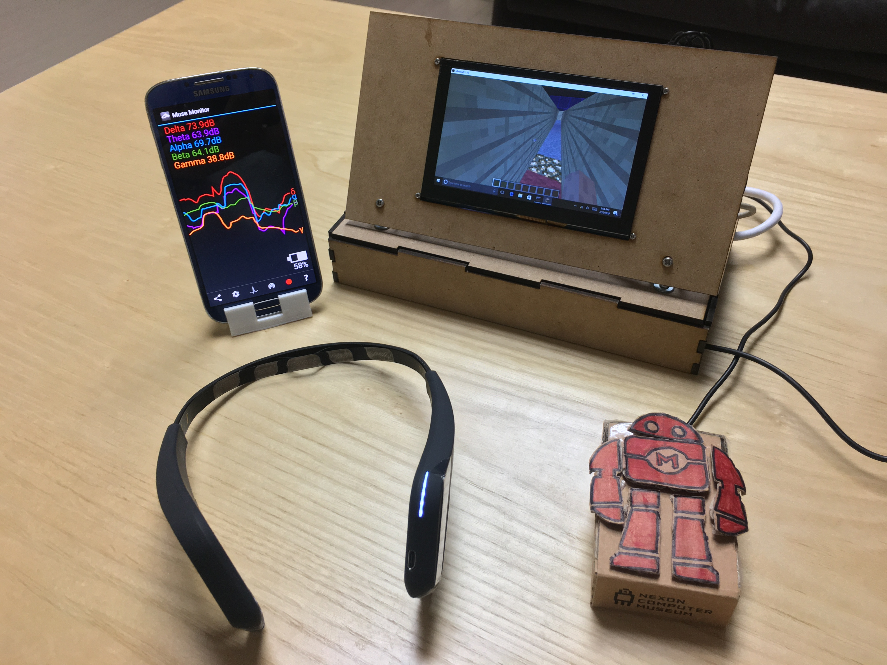
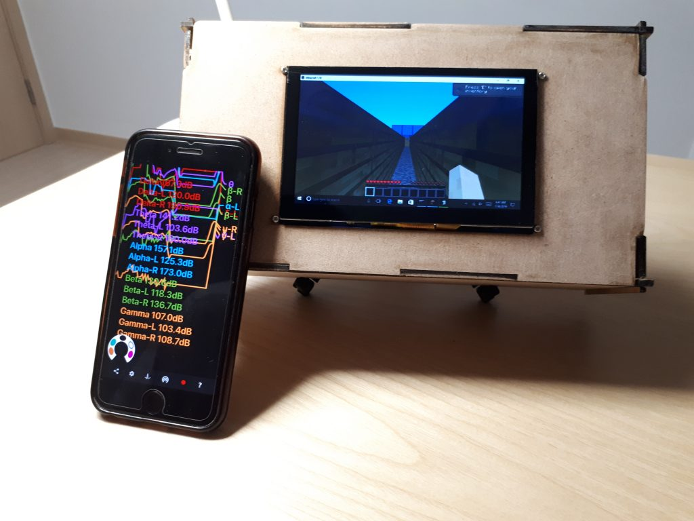
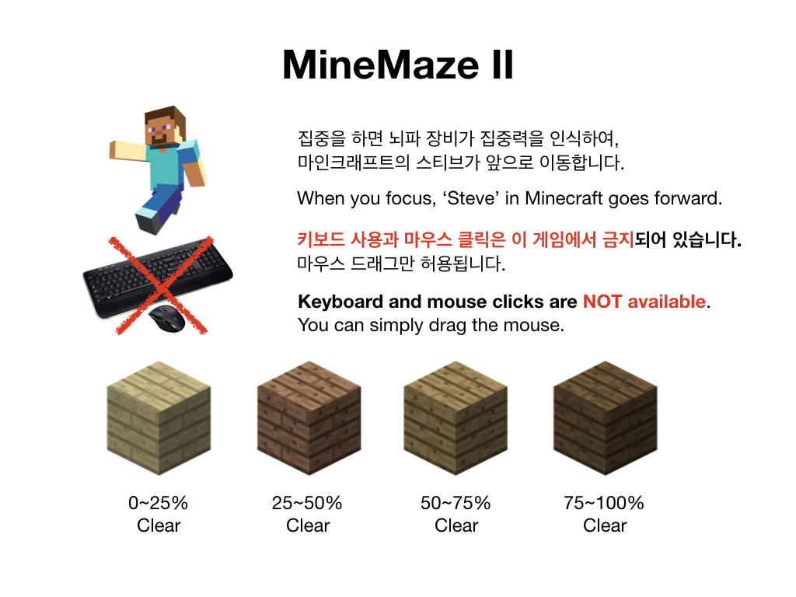
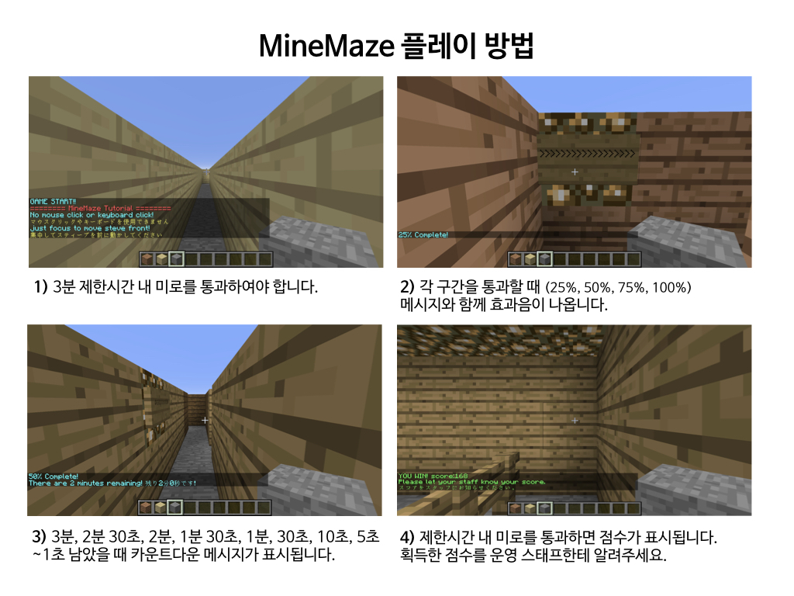
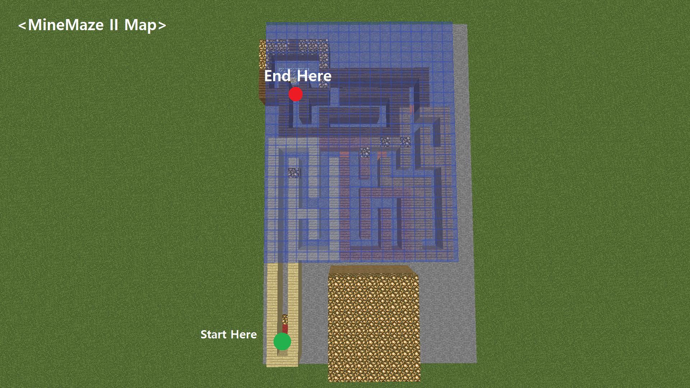

# MineMaze II
MineMaze II: ‘MineMaze II’ is a project includes EEG Focus Recognition + Minecraft Maze Game (Developed Java Plugin to add function for suitable to maze game) project. When user focus, EEG-OpenBCI and Python Software detects the brainwave and ‘Steve’ in Minecraft goes forward. (Used Python language to make a focus detection algorithm) Use your brain to escape the maze within the time limit!

(2018 Maker Faire Tokyo, 2018 Maker Faire Seoul, 2019 Maker Faire Seoul, Tsukuba Mini Maker Faire 2020, Virtually Maker Faire 2020)

## How to use
1. Insert this plugin into Minecraft Bukkit Server (MineMaze.jar)

## Demonstration

## Dependencies
Tested in Minecraft 1.10 Version.
